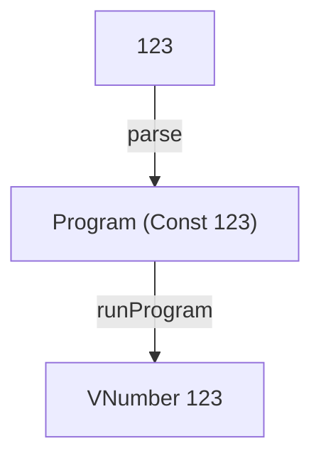

# CONST

A tiny interpreter in Elm that evaluates non-negative integer constants.

Read [CONST: The Structure of a Tiny Interpreter in Elm](https://blog.tinyinterpreters.dev/posts/const) for a guided explanation of how it works.



## Run it

You’ll need [Nix](https://nixos.org/) with flakes enabled.

```bash
nix develop
elm repl
```

Then, in the Elm REPL:

```elm
import CONST.Interpreter as I

I.run "123"
-- Ok (VNumber 123)
```
