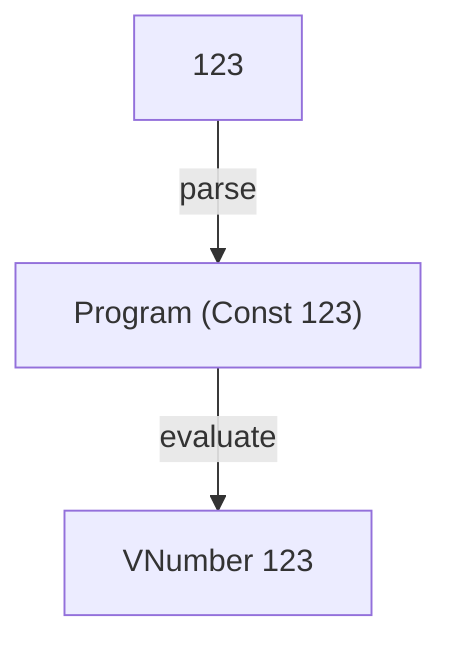

# CONST

CONST is the first [Tiny Interpreters](https://blog.tinyinterpreters.dev/) interpreter. A complete program is just a non-negative integer literal:

```txt
123
```

That lets us follow a complete program from source text to an evaluated value:



For a closer look at each step, read [CONST: From Source Text to Value](https://blog.tinyinterpreters.dev/posts/const/).

To try it, you'll need [Nix](https://zero-to-nix.com/start/install/) with flakes enabled.

```bash
nix develop
elm repl
```

Then:

```elm
import CONST.Interpreter as I

I.run "123"
-- Ok (VNumber 123)
```
