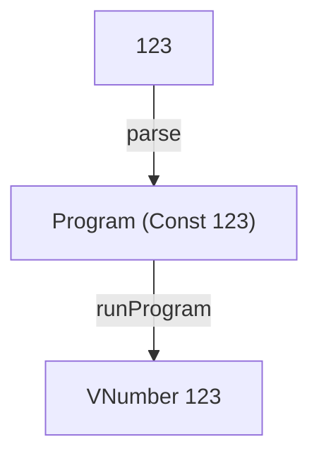

# CONST

A tiny interpreter in Elm that evaluates non-negative integer constants and establishes the interpreter structure reused throughout Tiny Interpreters.

Read [CONST: The Structure of a Tiny Interpreter in Elm](https://blog.tinyinterpreters.dev/posts/const) for a guided explanation of how it works.



## Usage

You’ll need [Nix](https://nixos.org/) with flakes enabled.

Enter the development environment and start the Elm REPL:

```bash
nix develop
elm repl
```

Import the interpreter and run a program:

```elm
import CONST.Interpreter as I

I.run "123"
-- Ok (VNumber 123)
```

## Language

CONST supports one kind of expression: a non-negative integer constant.

```txt
123
```

The parser converts the source text into an abstract syntax tree:

```elm
Program (Const 123)
```

The interpreter then evaluates the AST to a value:

```elm
VNumber 123
```

## Interpreter structure

CONST introduces the structure that the later interpreters build on:

```txt
source text → AST → value
```

Although the language contains only constants, the project includes the same main parts that will remain as the language grows:

* a grammar describing the concrete syntax
* an AST representing the program
* a parser that constructs the AST
* an interpreter that evaluates it

## Tiny Interpreters

CONST is the first interpreter in [Tiny Interpreters](https://blog.tinyinterpreters.dev), a blog about learning how programming languages work by building small interpreters in Elm.
